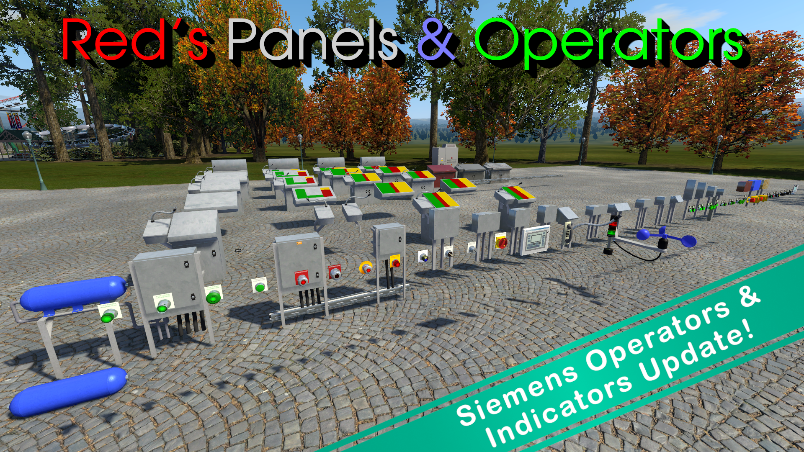

___

#### Description:
"Red's Panels and Operators" is the ultimate control panel toolkit for NoLimits 2 Roller Coaster Simulator. Packed with a wide selection of SCO panels, animated controls, indicators, and accessories, it lets you design everything from simple operator stations to complex main control panels. Featuring 40 different styles of highly detailed, fully scripted operators modeled after real Allen-Bradley® and Siemens® hardware, each with extensive configuration options, the possibilities are virtually endless. Combined with functionality that goes beyond the stock NL2 operators and a variety of supporting scenery such as electrical panels and cable runners, this pack makes it easy to bring an unmatched level of realism to your rides and parks!

___

#### Notes:

- This repository is mainly to help with versioning. Easier places to download this pack are either the [Steam Workshop page](https://steamcommunity.com/sharedfiles/filedetails/?id=2325974526) or the [NoLimits Central page](https://nolimitscentral.com/exchange/park/1476).
- A more complete README with instructions on how to use the pack can be found here:
  - `\scenery\reds_panels_and_operators\!README.html`

___

#### Trademark Notice:

- Allen-Bradley, 800T, 856T, and PanelView are registered trademarks of Rockwell Automation, Inc.
- Siemens, 3SU1, and LOGO! are registered trademarks of Siemens AG.
- CES is a registered trademark of C. Ed. Schulte GmbH.
- RONIS is a registered trademark of DOM Ronis SAS.

**The assets included in this pack are unofficial fan-made recreations and are not affiliated with, endorsed by, or sponsored by these companies.**
